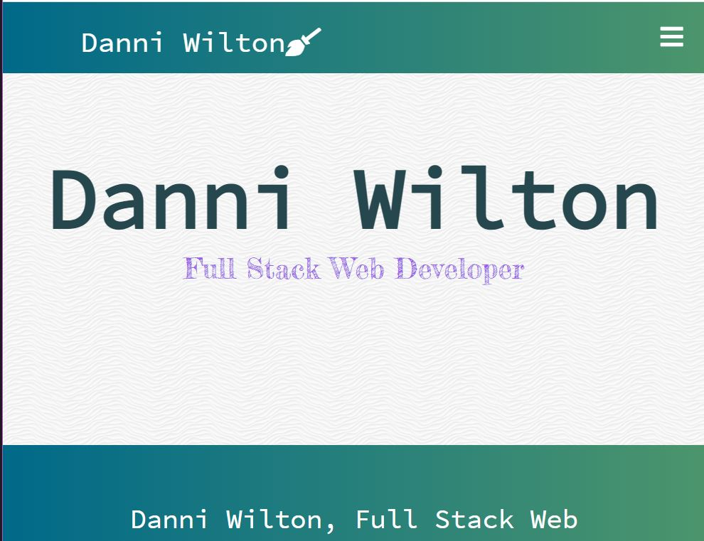
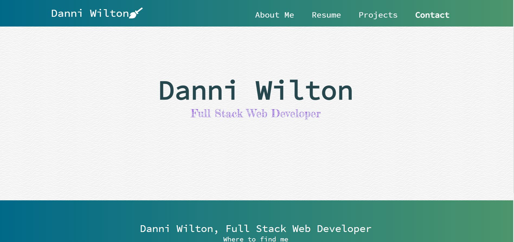
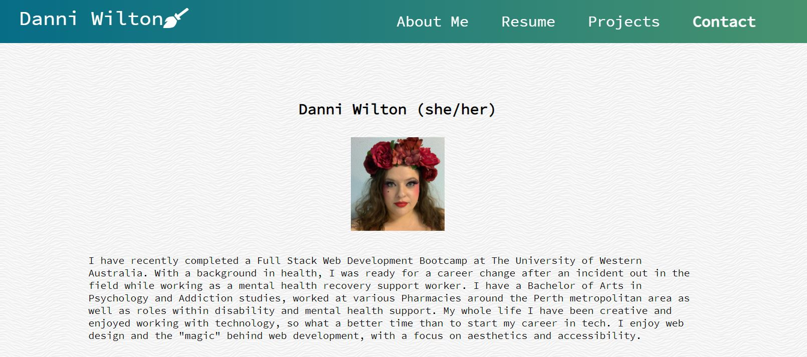

# React Portfolio

## Description
My react portfolio!

My react portfolio website uses:
- React
- Javascript
- HTML
- CSS
- JSON
- Emailjs

## Usage

- When you first go to my react portfolio website, you are presented with a basic home page. 
- The navigation bar has 4 tabs, About, Resume, Projects and Contact.
- The Home tab brings the user back to the home, this can be used throughout the app. 
- The About tab takes you to a page with a brief bio of myself an a recent photo.
- The Resume tab takes you to a page that has a link to my resume.
- The Projects tab takes you to a page that has 6 of my projects and links to their github and deployed pages.
- The Contact tab takes you to a form where you can enter your details and send me a message, I recieve an email from this. 
- The footer has a link to my contact page, my linkedIn and github.

## Links

Github Repo: https://github.com/DanniWilton/dw-portfolio
Github Pages Depo: https://danniwilton.github.io/

## Screen Captures

